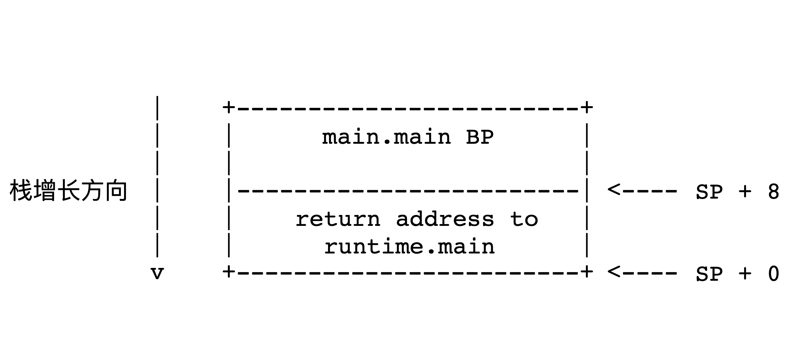
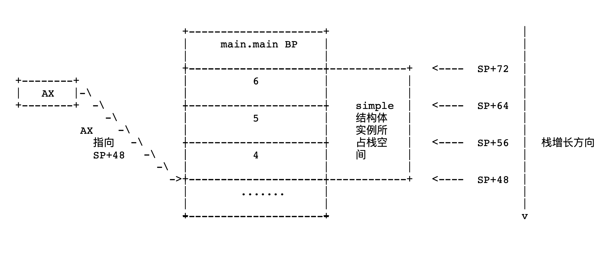

# Chapter 1: Go 汇编

<!--toc:start-->

- [Chapter 1: Go 汇编](#chapter-1-go-汇编)
  - [前言](#前言)
  - [伪汇编](#伪汇编)
  - [简单的程序](#简单的程序)
  - [第一个程序](#第一个程序)
    - [深入 simple 函数](#深入-simple-函数)
    - [深入 main 函数](#深入-main-函数)
    - [总结](#总结)
  - [第二个程序](#第二个程序)
    - [深入 simple.set 方法](#深入-simpleset-方法)
    - [深入 simple.setp 方法](#深入-simplesetp-方法)
    - [深入 main 方法](#深入-main-方法)
    - [总结](#总结)
  - [第三个程序](#第三个程序)
  - [链接](#链接)
  <!--toc:end-->

​ 在开始更深入了解 Go 的内部实现前我们必须对 Go 语言的汇编表示有所了解，同时此章节对其他语言的学习者也应该有所裨益，因此我将汇编作为第一章的内容，希望接下来的内容能帮助大家在后续的阅读中更快掌握精髓。

## 前言

​ Golang 是一个不断变化的开源项目，就在阅读此行的此时此刻也许就有所改变，并且由于对于不同平台生成的汇编代码其规范都大相径庭，因此本文以及后续文章都只会将平台限制在 `linux/amd64`，版本限制在`1.18.4`，此外知识繁多引用繁杂且多有变动因此难免有所谬误，也欢迎读者指正。

```bash
$ go version
go version go1.18.4 linux/amd64
```

​ 此外对于像此文一样的 internal analysis 文章将不可避免的对读者的基础知识有所要求且默认读者可以正常阅读计算机方向的英语资料，因此本文以及后续文章不会对基础知识例如基础编译原理，基础计算机组成原理，基础的操作系统术语进行过多解释，如有阅读障碍请自行善用 Google&教科书。

​ 经过本章的阅读后你应该可以学习到如下知识

- **基本**的 Plan9 汇编代码格式和**几个**基础的指令。
- Plan9 汇编代码在内存执行时的**调用规约（go1.17 后）**。
- Go 语言是如何如何实现**动态**大小栈空间的。
- Go 语言值类型与指针类型接收者行为差异在汇编层次的原由。
- Go 语言**范型**在汇编层次的表达。

## 伪汇编

​ 就像我们描述算法使用伪代码一样，Go Compiler 实际上并不会直接生成对应平台的汇编代码相反的它只是像 Java Compiler 生成字节码一样生成伪汇编代码，有所不同的地方在与 Java Compiler 生成的字节码将会被 VM 执行的时候翻译成可执行指令而 Go Compiler 生成的伪汇编代码将会被 Go Assembler 解析并根据当前平台或指定目标平台生成对应的汇编代码，对此感兴趣的读者可以自行阅读 [**The Design of the Go Assembler**](#链接) [^1]。

​ 因此下面所有说到的汇编皆是指代伪汇编，也就是 Go 语言使用的 Plan9 汇编。

## 简单的程序

​ 作为我们理解上述内容的第一步我们需要编写一个简单的 Go 程序，为了覆盖 Go 语言的几个经典的场景在汇编下的表示，我们的代码会逐步满足如下三个要求。

- 有函数
- 有值接收者和指针接收者方法
- 在上述的基础之上加入范型机制

​ 在第一个要求的程序中我们将会入门学习基本的 Plan9 汇编代码，在第二个程序中我们将学习到所谓的方法在汇编层次的表达，在第三个程序中我们将了解 Go 语言最新重大语言特性 Generic 的具体汇编表示。这三个程序基本描述了目前 Go 程序代码的最基本结构，想必在认真学习阅读此文章后任何读者都可以在看到任何 Go 代码后便能对其背后的汇编代码有所映象。

## 第一个程序

```golang
package main

//go:noinline
func simple(a int) bool {
	return a == 1
}

func main() {
	simple(1)
}
```

​ 需要注意的是注释中的*//go:noinline*并不像普通 go 语言注释一般在第一个字符和*//*之间包含一个空格，此行注释是对编译器的标识让其不将此函数内联当然你也可以在编译时给编译器传递`-l`参数让编译器不进行内联，感兴趣的读者可以自行将注释删除看看编译后的汇编代码区别。

​ 执行如下代码生成汇编代码文本，需要**注意**的是我们并**没有**给编译器指定`-N`参数也就是并没有禁止编译器进行优化，在学习完这章后读者可以试着在`-S`参数后添加`-N`然后看看汇编代码的区别。

```bash
$ GOOS=linux GOARCH=amd64 go tool compile -S simple.go >  simple.s && rm simple.o
```

​ 打开目录下的 simple.s 文件则可以看到如下编译出的汇编代码

```assembly
"".simple STEXT nosplit size=8 args=0x8 locals=0x0 funcid=0x0 align=0x0
	0x0000 00000 (simple.go:4)	TEXT	"".simple(SB), NOSPLIT|ABIInternal, $0-8
	0x0000 00000 (simple.go:4)	FUNCDATA	$0, gclocals·33cdeccccebe80329f1fdbee7f5874cb(SB)
	0x0000 00000 (simple.go:4)	FUNCDATA	$1, gclocals·33cdeccccebe80329f1fdbee7f5874cb(SB)
	0x0000 00000 (simple.go:4)	FUNCDATA	$5, "".simple.arginfo1(SB)
	0x0000 00000 (simple.go:4)	FUNCDATA	$6, "".simple.argliveinfo(SB)
	0x0000 00000 (simple.go:4)	PCDATA	$3, $1
	0x0000 00000 (simple.go:5)	CMPQ	AX, $1
	0x0004 00004 (simple.go:5)	SETEQ	AL
	0x0007 00007 (simple.go:5)	RET
	0x0000 48 83 f8 01 0f 94 c0 c3                          H.......
"".main STEXT size=47 args=0x0 locals=0x10 funcid=0x0 align=0x0
	0x0000 00000 (simple.go:8)	TEXT	"".main(SB), ABIInternal, $16-0
	0x0000 00000 (simple.go:8)	CMPQ	SP, 16(R14)
	0x0004 00004 (simple.go:8)	PCDATA	$0, $-2
	0x0004 00004 (simple.go:8)	JLS	40
	0x0006 00006 (simple.go:8)	PCDATA	$0, $-1
	0x0006 00006 (simple.go:8)	SUBQ	$16, SP
	0x000a 00010 (simple.go:8)	MOVQ	BP, 8(SP)
	0x000f 00015 (simple.go:8)	LEAQ	8(SP), BP
	0x0014 00020 (simple.go:8)	FUNCDATA	$0, gclocals·33cdeccccebe80329f1fdbee7f5874cb(SB)
	0x0014 00020 (simple.go:8)	FUNCDATA	$1, gclocals·33cdeccccebe80329f1fdbee7f5874cb(SB)
	0x0014 00020 (simple.go:9)	MOVL	$1, AX
	0x0019 00025 (simple.go:9)	PCDATA	$1, $0
	0x0019 00025 (simple.go:9)	CALL	"".simple(SB)
	0x001e 00030 (simple.go:10)	MOVQ	8(SP), BP
	0x0023 00035 (simple.go:10)	ADDQ	$16, SP
	0x0027 00039 (simple.go:10)	RET
	0x0028 00040 (simple.go:10)	NOP
	0x0028 00040 (simple.go:8)	PCDATA	$1, $-1
	0x0028 00040 (simple.go:8)	PCDATA	$0, $-2
	0x0028 00040 (simple.go:8)	CALL	runtime.morestack_noctxt(SB)
	0x002d 00045 (simple.go:8)	PCDATA	$0, $-1
	0x002d 00045 (simple.go:8)	JMP	0
```

​ 接下来逐行深入查看上述展示的汇编代码，首先从解析 simple 函数开始，随后解析 main 函数。

### 深入 simple 函数

```assembly
0x0000 00000 (main.go:4)	TEXT  "".simple(SB), NOSPLIT|ABIInternal, $0-8
```

- `0x0000`: 当前指令相对于函数开始的的偏移值 （16 进制）。
- `00000`: 当前指令相对于函数开始的的偏移值 （10 进制）。
- `(mian.go:4)`：显而易见只是指代此指令对应文件 main.go 的第 4 行。
- `TEXT "".simple(SB)`: **TEXT**标识出`"".simple(SB)` Symbol 位于可执行文件的`.text`部分同时也标识出下面第一条指令到下一个**TEXT**标识前的最后一条指令是该**TEXT**标识出的函数的所有指令。
- `SB`：`SB`则是指代保存了**static-base**指针的虚拟寄存器， **static-base**指针指向整个程序空间最开始的位置。`"".simple(SB)` 则表示 Symbol 位于相对于`SB`的常量偏移值处，具体位置则是在链接阶段由 Linker 来负责计算。这一点可以使用`objdump`看到。

```bash
# -gcflags 让compiler不进行内联
$ go build -gcflags='-l' .
$ objdump -j .text -t simple-go  | grep main.simple
0000000100051550 l     F __TEXT,__text _main.simple
```

- `NOSPLIT|ABIInternal`：则是给编译器的标识符，`NOSPLIT`用于告诉编译器不需要在此函数自动插入用于检查函数 stack 是否需要进行扩容的**_stack-split_**检查指令。`ABIInternal`标识此汇编调用规约为 ABIInternal，简单的说 Go 目前有 ABI0 ABIInternal ABI1 三中调用规约，前两者已经实现并使用，在未来当 ABIInternal 稳定后将会变为 ABI1，随后 ABI1 将会继续发展。对于更详细的计划和情况读者可以阅读 [**Go internal ABI specification**](#链接) [^3] 和 [**Internal ABI Proposal**](#链接) [^4]。

- `$0-8`：`$0`表示此函数执行将会申请的栈帧大小为 0，`$8`则是表示由调用者（main 函数）传递给被调用者（simple 函数）的参数大小。

  > 实际上这个大小是编译器优化后的占用大小，如果我们指定-N 参数进行编译实际上会看到优化前 simple 函数占用的栈帧大小其实可不小。

```assembly
0x0000 00000 (simple.go:4)	FUNCDATA	$0, gclocals·33cdeccccebe80329f1fdbee7f5874cb(SB)
0x0000 00000 (simple.go:4)	FUNCDATA	$1, gclocals·33cdeccccebe80329f1fdbee7f5874cb(SB)
0x0000 00000 (simple.go:4)	FUNCDATA	$5, "".simple.arginfo1(SB)
0x0000 00000 (simple.go:4)	FUNCDATA	$6, "".simple.argliveinfo(SB)
0x0000 00000 (simple.go:4)	PCDATA	$3, $1
```

​ 上述的`FUNCDATA`与`PCDATA`便是 Compiler 在编译过程中自动插入的执行期信息保存指令，他们存储的信息将会在运行期间被垃圾回收器以及 runtime 使用，因为对于绝大部分读者这些指令了解与否对理解程序执行不会有太大影响因此我们先暂时跳过它们，在后面的垃垃圾回收器章节我们会再来详细讲解它们。如果你对它们现在就十分好奇那可以选择阅读 [**Runtime Symbol Information**](#链接) [^2] 进行了解。同时在后续讲解中我们先暂时忽视它们。

> 实际上对于这些指令我也没有想到好的名称，再考虑到这些指令对于 Linker 是透明的其本身也只是一种在 Compile 阶段与 Runtime 阶段传递必要辅助信息需要的手段，因此姑且把他们统一叫做执行期信息保存指令。

```assembly
0x0000 00000 (simple.go:5)	CMPQ	AX, $1
0x0004 00004 (simple.go:5)	SETEQ	AL
0x0007 00007 (simple.go:5)	RET
```

​ 对于`CMPQ AX, $1`将会对比 AX 寄存器存储值和 1 的大小,`SETEQ AL`则会根据上一条`CMPQ`指令对比的结果决定`AL`中将会写入的值。简单的说当 CMPQ 返回相等时 AL 将会被置为 1 并对应 simple 函数返回的 bool 值，因为我们在 mian 函数中并没有使用返回值因此汇编代码中也没有其他地方使用了`AL`。感兴趣的读者可以试着让 simple 函数的返回值赋值给一个变量看看汇编代码有何改变。最后的`RET`指令则显然就是简单的返回上一级调用

> 需要注意的是在 go1.17 以前 go 语言只支持使用 stack 来传递调用参数，在 1.17 及以后 go 在**部分平台**实现了基于 register 的参数传递规约具体详情可以查看 [**Go 1.17 Release Note**](#链接) [^5]，不过参数与返回值空间申请和保存依旧如以前一样是交给调用者。

### 深入 main 函数

```asm
0x0000 00000 (simple.go:8)	TEXT	"".main(SB), ABIInternal, $16-0
```

​ 与 simple 一致不再赘述。

```assembly
0x0000 00000 (simple.go:8)	CMPQ	SP, 16(R14)
0x0004 00004 (simple.go:8)	JLS	40
********* between code *********
0x0028 00040 (simple.go:10)	NOP
0x0028 00040 (simple.go:8)	CALL	runtime.morestack_noctxt(SB)
```

> 需要注意的是此处 SP 寄存器是对应 amd64 平台物理寄存器，而非虚拟寄存器。

​ 前两条指令在官方 doc 中被称为**Go stack growth prologue**，也就是在执行前检查当前 SP 寄存器值是否超出`$16-0`所声明的 16 字的 StackFrame 大小，对于`16(R14)`则必须先引入一点点 runtime 的知识，首先`R14`存储有当前**正在执行**的 goroutine 的结构体实例(部分需要关注代码如下)的指针，

> 为何 R14 指向正在执行的 goroutine 可以查看 **Internal ABI** [^8]

```go
// go/src/runtime/runtime2.go
type g struct {
	stack       stack   // offset known to runtime/cgo stack内嵌结构体大小为16字节
	stackguard0 uintptr // offset known to liblink
	stackguard1 uintptr // offset known to liblink
  // other  code
}
```

`16(R4)`则指向结构体实例偏移值为 16 的字段也就是`stackguard0`，所以此行指令便是比较 SP 与 stackguard0 的大小，如果 SP 值小于或等于 stackguard0 值则跳转到 40 偏移位置指令执行,可以看到 40 偏移位置指令实际上就是调用`runtime.morestack_noctxt(SB)`来扩张 stack 的大小（关于此 runtime 函数的操作将在 runtime 章节介绍），这也和之前 simple 函数的`NOSPILT`相印证----main 函数没有`NOSPLIT`标识所以编译器便自动插入了**stack growth prologue**，这同时也是 go 可以获得动态 stack size 能力的原因。

```assembly
0x0006 00006 (simple.go:8)	SUBQ	$16, SP
```

​ 此行指令则让 SP 寄存器的值减少 16 字节也就是在内存中开辟了一个大小为 16 字节的栈帧

```assembly
0x000a 00010 (simple.go:8)	BP, 8(SP)
0x000f 00015 (simple.go:8)	LEAQ	8(SP), BP
********* between code *********
0x001e 00030 (simple.go:10)	MOVQ	8(SP), BP
0x0023 00035 (simple.go:10)	ADDQ	$16, SP
```

​ 第一行指令将 BP 寄存器中的值保存到 SP+8 位置的栈内存位置，第二行指令并将当前 SP+8 栈内存位置指针保存到 BP 寄存器中，对于初学者这里可能比较绕，可以查看 **Difference between MOV and LEA** [^6] 理解两个指令的差别便可容易理解其含义。随后可以看到在调用完 simple 后的 30 与 35 偏移位置指令就将原先保存在 SP+8 的调用者（main 函数）的 BP 数据取出放回了 BP 寄存器中并回收了刚刚申请的 16 个字节的 stack。

> 实际上 BP 保存只在 frame size > 0 时出现，一般来说 BP 只用于 kernel 在进行采样分析的时候遍历 stack 使用，一般来说这种情况只会出现在使用 platform debuggers 和 profilers 的时候 ，感兴趣的读者可以阅读 [**The discussion of BP**](#链接) [^7] & [**Internal ABI**](#链接) [^4]。

​ 这便到了第一个程序最后我们需要关注的两行指令了

```assembly
0x0014 00020 (simple.go:9)	MOVL	$1, AX
0x0019 00025 (simple.go:9)	CALL	"".simple(SB)
```

​ `MOVL	$1, AX`将数字 1 转移到 AX 寄存器中以供 simple 函数中使用,`CALL	"".simple(SB)`则调用 simple 函数之后便是在最开始我们在[[##深入 simple 函数]]中看到的逻辑了。

### 总结

​ 到这里我们就走完了第一个程序的汇编表示的所有流程，是不是意外的简单呢，没错这就是 golang 的最大优势简单易懂，下面的图便是上述过程中时的 stack 状态。



## 第二个程序

```go
package main

type simple struct {
	p1 int
	p2 int
	p3 int
}

func (s simple) set(a int, b int, c int) {
	s.p1 = a
	s.p2 = b
	s.p3 = c
}

func (s *simple) setp(a int, b int, c int) {
	s.p1 = a
	s.p2 = b
	s.p3 = c
}

func main() {
	s := simple{}
	s.set(1, 2, 3)
	s.setp(4, 5, 6)
}
```

​ 与第一个程序不同之处在于我们引入了一个包含三个 int filed 的结构体 simple，并为其实现了值接收者方法和指针接收者方法，下面就是其对应的我们需要关注的汇编代码，为了减少其他内容的干扰下面的汇编代码中已经**删除**其中的所有运行期信息保存指令，栈空间扩容检查指令，BP 地址保存指令。

​ 执行此行代码。

> 注意使用了`-l`参数禁止内联，没有使用`-N`参数禁止优化。

```bash
$ GOOS=linux GOARCH=amd64 go tool compile -S -l simple2.go >  simple2.s && rm simple2.o
```

​ 经过上述删除后得到如下汇编代码。

```assembly
"".simple.set STEXT nosplit size=1 args=0x30 locals=0x0 funcid=0x0 align=0x0
	0x0000 00000 (simple2.go:9)		TEXT	"".simple.set(SB), NOSPLIT|ABIInternal, $0-48
	0x0000 00000 (simple2.go:13)	RET
"".(*simple).setp STEXT nosplit size=12 args=0x20 locals=0x0 funcid=0x0 align=0x0
	0x0000 00000 (simple2.go:15)	TEXT	"".(*simple).setp(SB), NOSPLIT|ABIInternal, $0-32
	0x0000 00000 (simple2.go:16)	MOVQ	BX, (AX)
	0x0003 00003 (simple2.go:17)	MOVQ	CX, 8(AX)
	0x0007 00007 (simple2.go:18)	MOVQ	DI, 16(AX)
	0x000b 00011 (simple2.go:19)	RET
"".main STEXT size=111 args=0x0 locals=0x50 funcid=0x0 align=0x0
	0x0000 00000 (simple2.go:21)	TEXT	"".main(SB), ABIInternal, $80-0
	0x0006 00006 (simple2.go:21)	SUBQ	$80, SP
	0x0014 00020 (simple2.go:22)	MOVQ	$0, "".s+48(SP)
	0x001d 00029 (simple2.go:22)	MOVUPS	X15, "".s+56(SP)
	0x0023 00035 (simple2.go:23)	XORL	AX, AX
	0x0025 00037 (simple2.go:23)	MOVQ	AX, BX
	0x0028 00040 (simple2.go:23)	MOVQ	AX, CX
	0x002b 00043 (simple2.go:23)	MOVL	$1, DI
	0x0030 00048 (simple2.go:23)	MOVL	$2, SI
	0x0035 00053 (simple2.go:23)	MOVL	$3, R8
	0x0040 00064 (simple2.go:23)	CALL	"".simple.set(SB)
	0x0045 00069 (simple2.go:24)	LEAQ	"".s+48(SP), AX
	0x004a 00074 (simple2.go:24)	MOVL	$4, BX
	0x004f 00079 (simple2.go:24)	MOVL	$5, CX
	0x0054 00084 (simple2.go:24)	MOVL	$6, DI
	0x0059 00089 (simple2.go:24)	CALL	"".(*simple).setp(SB)
	0x0063 00099 (simple2.go:25)	ADDQ	$80, SP
	0x0067 00103 (simple2.go:25)	RET
```

### 深入 simple.set 方法

​ 嗯.....，好吧任何读者都应该已经看到，编译器已经足够智能在优化编译出的的指令中删除所有赋值操作，也就是 simple.set 方法啥都没干自然我们也没法深入了解。感兴趣的读者可以在编译指令中添加`-N`参数看看优化前的指令是怎么样的。

### 深入 simple.setp 方法

```assembly
"".(*simple).setp STEXT nosplit size=12 args=0x20 locals=0x0 funcid=0x0 align=0x0
	0x0000 00000 (main.go:15)	TEXT	"".(*simple).setp(SB), NOSPLIT|ABIInternal, $0-32
	0x0000 00000 (main.go:16)	MOVQ	BX, (AX)
	0x0003 00003 (main.go:17)	MOVQ	CX, 8(AX)
	0x0007 00007 (main.go:18)	MOVQ	DI, 16(AX)
	0x000b 00011 (main.go:19)	RET
```

​ 嗯....，意外的 setp 方法也非常简单认真学习了第一个程序汇编代码的读者肯定可以一眼看出 setp 方法只是简单的把`BX`,`CX`,`DI`寄存器中存储的值分别转移到 AX,AX+8,AX+16 地址的栈位置上稍后我们会在 main 函数中看到这四个寄存器的值是如何被初始化的和指向哪里的。

### 深入 main 方法

```assembly
"".main STEXT size=111 args=0x0 locals=0x50 funcid=0x0 align=0x0
	0x0000 00000 (simple2.go:21)	TEXT	"".main(SB), ABIInternal, $80-0
	0x0006 00006 (simple2.go:21)	SUBQ	$80, SP
	0x0014 00020 (simple2.go:22)	MOVQ	$0, "".s+48(SP)
	0x001d 00029 (simple2.go:22)	MOVUPS	X15, "".s+56(SP)
	0x0023 00035 (simple2.go:23)	XORL	AX, AX
	0x0025 00037 (simple2.go:23)	MOVQ	AX, BX
	0x0028 00040 (simple2.go:23)	MOVQ	AX, CX
	0x002b 00043 (simple2.go:23)	MOVL	$1, DI
	0x0030 00048 (simple2.go:23)	MOVL	$2, SI
	0x0035 00053 (simple2.go:23)	MOVL	$3, R8
	0x0040 00064 (simple2.go:23)	CALL	"".simple.set(SB)
	0x0045 00069 (simple2.go:24)	LEAQ	"".s+48(SP), AX
	0x004a 00074 (simple2.go:24)	MOVL	$4, BX
	0x004f 00079 (simple2.go:24)	MOVL	$5, CX
	0x0054 00084 (simple2.go:24)	MOVL	$6, DI
	0x0059 00089 (simple2.go:24)	CALL	"".(*simple).setp(SB)
	0x0063 00099 (simple2.go:25)	ADDQ	$80, SP
	0x0067 00103 (simple2.go:25)	RET
```

```assembly
0x0006 00006 (simple2.go:21)	SUBQ	$80, SP
```

​ 首先开辟了 80 个字节大小的栈空间。

```assembly
0x0014 00020 (simple2.go:22)	MOVQ	$0, "".s+48(SP)
0x001d 00029 (simple2.go:22)	MOVUPS	X15, "".s+56(SP)
```

​ `MOVQ  $0, "".s+48(SP)`很简单只是将 SP+48 栈位置赋值为 0，实际上 SP+48 位置也是结构体 simple 在栈中的开始位置，也就是说 SP+48 到 SP+72 的 24 个字节栈空间便是 simple 结构体实例在栈上所占局的空间，`MOVUPS  X15, "".s+56(SP)`可能读者会有所困惑，因为 X15 在 amd64 平台的 Go 汇编中是一个特殊寄存器，在 [**Internal ABI**](#链接) [^4] 中我们可看到 amd64 平台的如下几个特殊寄存器，其中 X15 代表零值，因此偏移值 29 的此行指令便是将 SP+56 到 SP+72 的栈空间全部赋为零值。

> _Rationale_: We designate X15 as a fixed zero register because functions often have to bulk zero their stack frames, and this is more efficient with a designated zero register. 也就是说 X15 寄存器就是一个专门用来存储零值并用来给栈帧批量赋零的寄存器。

| Register | Call meaning            | Body meaning     |
| -------- | ----------------------- | ---------------- |
| RSP      | Stack pointer           | Fixed            |
| RBP      | Frame pointer           | Fixed            |
| RDX      | Closure context pointer | Scratch          |
| R12      | None                    | Scratch          |
| R13      | None                    | Scratch          |
| R14      | Current goroutine       | Scratch          |
| R15      | GOT reference temporary | Fixed if dynlink |
| X15      | Zero value              | Fixed            |

```assembly
0x0023 00035 (simple2.go:23)	XORL	AX, AX
0x0025 00037 (simple2.go:23)	MOVQ	AX, BX
0x0028 00040 (simple2.go:23)	MOVQ	AX, CX
0x002b 00043 (simple2.go:23)	MOVL	$1, DI
0x0030 00048 (simple2.go:23)	MOVL	$2, SI
0x0035 00053 (simple2.go:23)	MOVL	$3, R8
0x0040 00064 (simple2.go:23)	CALL	"".simple.set(SB)
```

​ 这几行汇编就很简单了首先使用`XORL`异或指令将`AX`置零，随后将`BX`,`CX`也置零，随后给`DI`,`SI`,`R8`寄存器分别置为 1，2，3 以便给 simple.set 方法进行使用，这里我们也能看到即使编译器优化去除了 simple.set 函数内部的赋值指令但依然还是会按照正常的调用规约在 Caller 中准备好要调用函数或方法的输入参数。随后使用`CALL`指令调用 simple.set 方法。

```assembly
0x0045 00069 (simple2.go:24)	LEAQ	"".s+48(SP), AX
0x004a 00074 (simple2.go:24)	MOVL	$4, BX
0x004f 00079 (simple2.go:24)	MOVL	$5, CX
0x0054 00084 (simple2.go:24)	MOVL	$6, DI
0x0059 00089 (simple2.go:24)	CALL	"".(*simple).setp(SB)
0x0063 00099 (simple2.go:25)	ADDQ	$80, SP
0x0067 00103 (simple2.go:25)	RET
```

​ 首先第 69 偏移的指令`LEAQ	"".s+48(SP), AX`将 SP+48 的栈空间地址放进了`AX`寄存器中，随后`BX`,`CX`,`DI`寄存器中分别被放置了 4,5,6 数字值，随后调用 setp 函数，随后便是上面[[##深入 simple.setp 方法]]所述的过程，由此可见实际上就是把 4,5,6 值分别放到了 SP+48，SP+56，SP+64 的栈位置也就是 simple 结构体实例的三个 Filed 分别被赋值为 4,5,6，最后便是`ADDQ`指令回收栈空间并调用`RET`会到 runtime.main 函数。

### 总结

​ 下图便是上述过程的栈空间



​ **不过等一下**，相必善于观察的读者一定会发现为啥编译器只用到了 SP+48 以上的空间但分配栈空间的时候为啥分配了 80 个字节，并且`set`与`setp`方法后的`$0-48`与`$0-32`加起来确实是 80。实际上之所以第二个程序此文没有在一开始便说明这一点便是为了留到此时作为一点小挑战，对此感到困惑的读者可以试着在编译参数中添加`-N`然后仔细查看汇编代码，想必认真阅读了上述两个程序讲解内容的读者一定可以轻松的靠自己找到原因。

## 第三个程序

```go
package main

type simple3[T any] struct {
	a T
	b T
	c T
}

func (s simple3[T]) set(a, b, c T) {
	s.a = a
	s.b = b
	s.c = c
}

func (s *simple3[T]) setp(a, b, c T) {
	s.a = a
	s.b = b
	s.c = c
}

func main() {
	s := simple3[int]{}
	s.set(1, 2, 3)
	s.setp(4, 5, 6)

	s2 := simple3[string]{}
	s2.set("a", "b", "c")
	s2.setp("d", "e", "f")
}
```

<!-- TODO: 确定泛型章节  -->

​ 在开始展示这部分代码的对应汇编代码前，读者最好先自行快速阅读一下 [**Generic Implementation**](#链接) [^9] 了解 Go 语言目前实现 Generic 的方式，这对理解接下来的汇编代码将有所帮助。对于范型我也会在后续单独开辟第六章节来详细讲解其实现。

> 简单的说 Go 的 Generic 并没有像 C++,Rust 一样通过类型特化（单态化）来实现，也不像 Java 那样抹除了类型信息，而是选择了在两者间的一条道路（Dictionaries and Gcshape Stenciling），这种选择虽然尽可能减少对 Go 语言编译速度的影响，但同时却需要付出难以进行 inline 等编译期优化的代价。具体的取舍与分析详见第六章。

​ 继续执行如下代码生成汇编代码，不过当打开 simple3.s 就会看到生成的远比之前代码复杂的汇编代码，因此下面将会一部分一部分的讲解。

```bash
$ GOOS=linux GOARCH=amd64 go tool compile -S  simple3.go >  simple3.s && rm simple3.o
```

​ 不同于之前我们一个个方法 or 函数对照学习其汇编，这次我们先把每个编译出的方法的第一行都列举出来，于是便能看到如下几个方法。

```assembly
"".simple3[go.shape.int_0].set STEXT dupok nosplit size=1 args=0x38 locals=0x0 funcid=0x0 align=0x0
"".(*simple3[go.shape.int_0]).setp STEXT dupok nosplit size=12 args=0x28 locals=0x0 funcid=0x0 align=0x0

"".simple3[go.shape.string_0].set STEXT dupok nosplit size=86 args=0x68 locals=0x0 funcid=0x0 align=0x0
"".(*simple3[go.shape.string_0]).setp STEXT dupok size=214 args=0x40 locals=0x8 funcid=0x0 align=0x0
```

​ 可以看到其中出现了`[go.shape.int_0]`,`[go.shape.string_0]`,`["".MyInt]`这样类似 go 泛型语法一样的内容，

## 链接

[^1]: [The Design of the Go Assembler](https://go.dev/talks/2016/asm.slide#1)
[^2]: [Runtime Symbol Information](https://docs.google.com/document/d/1lyPIbmsYbXnpNj57a261hgOYVpNRcgydurVQIyZOz_o/pub)
[^3]: [Go internal ABI specification](https://go.googlesource.com/go/+/refs/heads/dev.regabi/src/cmd/compile/internal-abi.md)
[^4]: [Internal ABI Proposal](https://go.googlesource.com/proposal/+/master/design/27539-internal-abi.md)
[^5]: [Go 1.17 Release Note](https://go.dev/doc/go1.17)
[^6]: [Difference between MOV and LEA](https://stackoverflow.com/questions/1699748/what-is-the-difference-between-mov-and-lea)
[^7]: [The discussion of BP](https://groups.google.com/g/golang-dev/c/aLn9t8tKg2o/m/Kw-N7lUuBAAJ)
[^8]: [Internal ABI](https://go.googlesource.com/go/+/refs/heads/dev.regabi/src/cmd/compile/internal-abi.md)
[^9]: [Generic Implementation](https://go.googlesource.com/proposal/+/30e9a8d11d1e84aafcbb10775b4c7d9e223214fa/design/generics-implementation-dictionaries-go1.18.md)
[^10]: [generics-can-make-your-go-code-slower](https://planetscale.com/blog/generics-can-make-your-go-code-slower)
