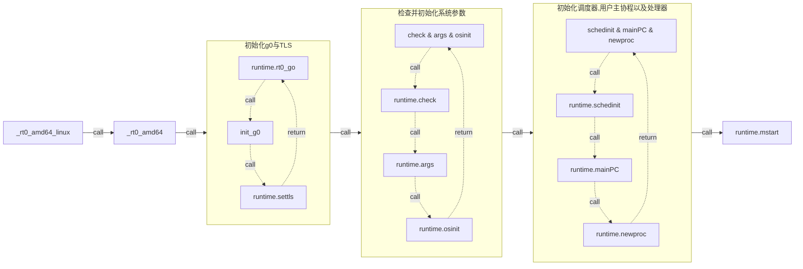

# Chapter 2: Go 协程

<!--toc:start-->

- [Chapter 2: Go 协程](#chapter-2-go-协程)
  - [Go 程序的启动](#go-程序的启动)
    - [Go 程序的 Entry Point](#go-程序的-entry-point)
    - [g0 协程的初始化](#g0-协程的初始化)
    - [TLS 的内部实现](#tls-的内部实现)
    - [存储 g0 协程的初始化 到 TLS](#存储-g0-协程的初始化-到-tls)
    - [检查并初始化系统参数](#检查并初始化系统参数)
    - [加载 runtime.main 并创建新 P](#加载-runtimemain-并创建新-p)
    - [运行 runtime.mstart](#运行-runtimemstart)
    - [最后的执行 main.main](#最后的执行-mainmain)
  - [链接](#链接)
  <!--toc:end-->

在这个章节将会介绍 Go 协程的实现机制，启动与执行方式。首先我们会通过讲解程序启动的过程来介绍特殊协程`g0`的启动过程从而理解最初的 go 协程是如何启动与初始化的，随后我们会深入到`runtime`中启动代码中用户定义的`go func() {}`函数代码来了解`g0`如何挂载在`m0`上调度并执行用户定义的协程。

> 实际上每个 `m` 都拥有自己的 `g0` 只是对于 `m0` 来说它的 `g0` 负责最开始的程序启动因此显得比较特殊。

## Go 程序的启动

整个启动的关节节点如下,我们主要关注初始化`初始化g0与TLS`以及`初始化用户主协程`部分，因为这两部分对于理解 Go 程序的启动最为关键，其他部分将在第三章节`scheduler`中提到。

> 点击下图黄色区域跳转到 github 查看对应汇编代码



### Go 程序的 Entry Point

首先创建一个非常简单的 main.go 文件，内容如下:

```go
package main

func main() {}
```

使用如下命令找到其入口执行处:

```bash
$ go tool compile goroutine.go
$ go tool link goroutine.o
$ objdump -f a.out

a.out:     file format elf64-x86-64
architecture: i386:x86-64, flags 0x00000112:
EXEC_P, HAS_SYMS, D_PAGED
start address 0x0000000000453860
```

可以看到**start address**是`0x0000000000453860`，使用如下命令反汇编执行文件查看这个位置对应的汇编代码:

```bash
$ objdump -d a.out > disassembly.s
$ cat disassembly.s | grep 453860
0000000000453860 <_rt0_amd64_linux>:
453860:       e9 3b e3 ff ff          jmpq   451ba0 <_rt0_amd64>
```

可以看到整个程序的入口函数是 `_rt0_amd64_linux`，接下来便是要在 go 的 src 代码中找到这个函数的定义，实际上这个函数便位于 `src/runtime/rt0_linux_amd64.s` ，打开这个文件便能看到如下汇编代码。顺着 JMP 一直向下寻找调用的函数我们将会找到真正开始执行的函数叫做 [rt0_go] ，整个跳转调用过程涉及两个文件三个汇编函数他们定义如下。

```asm
TEXT _rt0_amd64_linux(SB),NOSPLIT,$-8
  JMP	_rt0_amd64(SB)

TEXT _rt0_amd64(SB),NOSPLIT,$-8
  MOVQ	0(SP), DI	// argc
  LEAQ	8(SP), SI	// argv
  JMP	runtime·rt0_go(SB)

TEXT runtime·rt0_go(SB),NOSPLIT|TOPFRAME,$0
  # 可以看到此函数才是真正开始执行启动的汇编函数
```

### g0 协程的初始化

接下来的分析中将会忽视掉 `runtime·rt0_go` 中对程序启动主体逻辑理解没有影响的代码，我们只关注 g0 是什么，g0 的关键 filed 是如何被初始化的，g0 在后续执行中扮演的角色，此外由于此过程冗长复杂，因此将函数分为多个部分来介绍。
首先是基础的栈空间分配，仔细阅读了 chapter-1 的读者直接就能看出这部分只是简单分配了 48 字节的栈空间，顺便将 argc 与 argv 指针保存到了`SP+24`与`SP+32`的栈位置上。

```asm
MOVQ	DI, AX		// argc
MOVQ	SI, BX		// argv
SUBQ	$(5*8), SP		// 3args 2auto
ANDQ	$~15, SP
MOVQ	AX, 24(SP)
MOVQ	BX, 32(SP)
```

接下来便终于到了 _g0_ 登场的时候了，这部分汇编首先将 _g0_ 存储到了 `DI` Reg 上, 这里我们看到汇编中 _g0_ 的定义是 `runtime·g0(SB)`，在链接阶段这个符号会被链接到一个可执行文件的 data section 的静态变量上，而这个静态变量的定义就在 `src/runtime/proc.go` 中，其定义只有一行代码 `var g0 g` 其类型为 `g`。

随后`LEAQ	(-64*1024+104)(SP), BX`指令则是计算好 g0 的栈空间大小(**注意这里并没有修改 SP 寄存器的数据**)，随后将`BX`中的栈空间大小数据赋值给`g0.stackguard0`与`g0.stackguard1`两个 filed，同时将`BX`中数据赋值给`g0.stack.lo`（内存分配是向低地址位置扩展），将当前`SP`中数据赋值给`g0.stack.hi` 。

走完这部分实际上`g0`所拥有的初始栈空间就已经被分配好了，其位于`SP`到`SP-64*1024+104`的地址空间中。

```asm
MOVQ	$runtime·g0(SB), DI
LEAQ	(-64*1024+104)(SP), BX
MOVQ	BX, g_stackguard0(DI)
MOVQ	BX, g_stackguard1(DI)
MOVQ	BX, (g_stack+stack_lo)(DI)
MOVQ	SP, (g_stack+stack_hi)(DI)
```

```go
type stack struct {
    lo uintptr
    hi uintptr
}

type g struct {
    stack       stack   // offset known to runtime/cgo
    stackguard0 uintptr // offset known to liblink
    stackguard1 uintptr // offset known to liblink
    // ......省略.......
}
```

### TLS 的内部实现

在`amd64`平台上还有一个特殊的实现其涉及到了一个在`amd64`平台的特殊寄存器`TLS`（**Thread Local Storage**），在`amd64`平台上这个寄存器用来保存当前正在执行的 goroutine 的`g`结构体实例地址。

> 之所以叫 TLS 寄存器只是因为在 go 的伪汇编中将其视作为一个寄存器，实际上在 Linux 内核中以及实际物理 CPU 中是不存在这个寄存器的，其功能依赖于物理寄存器`FS`与`GS`来实现。具体细节可以查看 (简单的说就是把 `TLS` 的地址存放在 `FS` 寄存器中) [**TLS code**](#链接) [^3]

> 对于 go 语言中的 TLS 使用&解释可以直接阅读 [**TLS Comment**](#链接) [^4]，下面的汇编中需要运用到此 comment 中包含的知识，建议读者先阅读完再继续向下阅读。

> 需要注意的是在 amd64 平台 R14 寄存器也被用于存储当前正在执行的 go 协程地址，具体解释可以在 [**ABI-Internal**](#链接) [^6]的 amd64 架构部分看到

在[`runtime/asm_amd64.s`](https://github.com/golang/go/blob/c75b10be0b88c5b6767fd6fdf4e25a82a665fb76/src/runtime/asm_amd64.s#L232-L263)可以看到如下代码。

```asm
needtls:
  LEAQ	runtime·m0+m_tls(SB), DI
  CALL	runtime·settls(SB)

  // store through it, to make sure it works
  get_tls(BX)
  MOVQ	$0x123, g(BX)
  MOVQ	runtime·m0+m_tls(SB), AX
  CMPQ	AX, $0x123
  JEQ 2(PC)
  CALL	runtime·abort(SB)
```

认真阅读了 chapter-1 的读者想必已经看出了上面汇编代码实际上最重要的就是初始的两行，第一行把全局变量`runtime.m0`(所在位置与 g0 相同)中的`tls`Filed 地址保存到了`DI`寄存器，随后调用`runtime·settls`方法来初始化`tls`。

> 查看源码我们可以看到 m0.tls 的类型是`[tlsSlots]uintptr`其中`tlsSlots`的值等于 6，在源码中对此有所解释 ---- tlsSlots is the number of pointer-sized slots reserved for TLS on some platforms

我们看可以在 [`src/runtime/sys_linux_amd64.s`] 找到这个方法的具体实现如下所示。从注释中我们可以看到实际上这一块代码进行了一次`system call`调用了`arch_prctl`，并将`ARCH_SET_FS` [**arch_prctl**](#链接) [^2]作为调用参数使用，在这个系统调用中将会初始化`FS`段寄存器的基值位置，对此感兴趣的读者可以自行阅读 [**The segment**](#链接) [^1]，到此为止`SYSCALL`执行前入参便准备好了，其中`SI` = 指向`runtime·m0+m_tls(SB) + 8` 位置，`DI` = `$0x1002`代表常量`ARCH_SET_FS`
用于控制`arch_prctl`执行逻辑，`AX` = `$SYS_arch_prctl`指向系统调用位置，执行完后`FS_base`寄存器就存储了`runtime·m0+m_tls(SB) + 8`的地址(实际上就是`[tlsSlots]uintptr`索引为 1 所在地址)。随后的三行便是简单的错误检查了。

```asm
TEXT runtime·settls(SB),NOSPLIT,$32
  ADDQ	$8, DI	// ELF wants to use -8(FS)
  MOVQ	DI, SI
  MOVQ	$0x1002, DI	// ARCH_SET_FS
  MOVQ	$SYS_arch_prctl, AX
  SYSCALL
  CMPQ	AX, $0xfffffffffffff001
  JLS	2(PC)
  MOVL	$0xf1, 0xf1  // crash
  RET
```

最后 6 行`get_tls(BX)`开始就是简单的加载下 tls 地址，尝试写入数据读取数据检查一下 tls 可不可以正常使用。

> get_tls 只是个简单宏定义`#define	get_tls(r)	MOVL TLS, r`起作用仅仅是把 TLS 寄存器保存的 g 指针读取到指定的寄存器，g(BX)实际也是宏替换`#define	g(r)	0(r)(TLS*1)` -> `0(BX)(TLS*1)`其中`0(BX)`代表`BX`偏移为 0 的位置，后面的`(TLS*1)`只是一个标识符。具体细节请阅读[**ELF Handling For Thread-Local Storage**](#链接) [^6]中的 4.4.6 了解 x86-64 平台获取`TLS`的标准指令序列。

### 存储 g0 协程的初始化 到 TLS

正如前面所说`TLS`保存有当前正在执行的 go 协程实例指针，而当前有且只有准备好的`g0`协程需要执行，因此下一步便是将准备好的`g0`存储到`TLS`中。也就是[下面指令](https://github.com/golang/go/blob/c75b10be0b88c5b6767fd6fdf4e25a82a665fb76/src/runtime/asm_amd64.s#L264-L275)中的 `LEAQ	runtime·g0(SB), CX`和`MOVQ	CX, g(BX)`，随后就是把 m0.g0 指向`runtime.g0`以及 g0.m 指向`runtime.m0`（这部分涉及第三章 scheduler 中 GMP 部分知识）。

```ams
ok:
  // set the per-goroutine and per-mach "registers"
  get_tls(BX)
  LEAQ	runtime·g0(SB), CX
  MOVQ	CX, g(BX)
  LEAQ	runtime·m0(SB), AX

  // save m->g0 = g0
  MOVQ	CX, m_g0(AX)
  // save m0 to g0->m
  MOVQ	AX, g_m(CX)

```

到这里 TLS 中已经指向了 g0 协程，且 m0 与 g0 也绑定了双向关系。到这里我们的程序基本上已经实现了如下状态。随后的初始化参数&调度器操作暂时跳过，这部分内容将会在章节三 scheduler 中介绍。


### 检查并初始化系统参数

[`check`&`args`&`osinit`&`schedinit`] 在[`check`] 中`runtime`初始化基础类型实例然后检查了下它们的大小和其他属性，这部分对于理解 go 协程启动无关紧要感兴趣的读者可以自己查看。

紧随其后的[`args`] 就如其名一般负责将参数存储到静态变量中，需要注意的是在 Linux 上此函数还会负责分析 [**ELF auxiliary vector**](#链接) [^8]。

> 简单的说在`ELF auxiliary vector`包含了一些操作系统加载程序到内存中并执行需要的信息，比如程序 header 的数量和大小，一些系统调用的具体位置。也就是说它是一种向用户空间传递内核空间信息的机制。

最后的 [osinit] 和 [schedinit] 前者只是简单的通过`systemcall`获取一下 cpu 数量然后将其记录到 [`ncpu`] 中，对于`schedinit`则复杂得多，其负责初始化运行时内容并进行各种检查关于这部分内容将会在第三章详细讲解。

### 加载 runtime.main 并创建新 P

首先 [`$runtime·mainPC`] 实际上指向了 [`runtime.main`] 函数。
这部分的指令很简单只是将`$runtime·mainPC`的地址存储到`AX`寄存器中随后将`AX`中的值存储到 stack 上，并作为`runtime·newproc`的入参来使用，所以下面我们来重点关注 newproc 做了什么并如何使用 stack 上的`$runtime·mainPC`

```asm
// create a new goroutine to start program
MOVQ	$runtime·mainPC(SB), AX		// entry
PUSHQ	AX
CALL	runtime·newproc(SB)
POPQ	AX
```

[`newproc`] 首先我们就能看到其入参`fn *funcval`对应的就是上面提到的`runtime.main`函数，其他的步骤含义参考下方函数中的注释。对于其中调用的函数可以点击如下函数名阅读其定义与注释（注释写得比我写的好 😂 建议看官方的注释了解这些函数）。

- [`getg`]
  , [`getcallerpc`]
  , [`systemstack`]
  , [`newproc1`]
  , [`runqput`]
  , [`wakep`]

```go
func newproc(fn *funcval) {
  gp := getg()
  pc := getcallerpc()
  systemstack(func() {
    newg := newproc1(fn, gp, pc)
    pp := getg().m.p.ptr()
    runqput(pp, newg, true)

    if mainStarted {
      wakep()
    }
  })
}
```

首先 [`getg`] 获取当前正在运行的`g`也就是获取 [g0] (在 `amd64` 平台这行会被汇编重写为从 `R14` 或 `TLS` 寄存器获取)， `getcallerpc` 则获取调用者的调用者的 PC 其实也就是汇编中调用 `newpoc` 时的 PC(指向 `CALL	runtime·newproc(SB)` 的下一行指令)，其值将会被稍后创建的 `newg` 所持有。随后调用 `systemstack` 方法创建 `newg` 并将其放到了当前 `g0` 绑定的 `M` 对应的 `P` 的队列上，对于其中的 `newproc1` 主要任务就是将需要执行的函数入口 `fn` 绑定到创建的 `newg` （其父协程便是`g0`）上，对如何创建 `newg` 的过程感兴趣的读者可以自行阅读 [`newproc1`] 。

在创建完 `newg` 后便会将其放置到当前 `g` 也就是 `g0` 所绑定的 `M` 对应的 `P` 的局部可运行 g 队列上(local runnable queue)。因为此时 `mainStarted` 为 `false` 所以 `wakep()` 还不会被调用。

完成上述过程后机会执行启动函数 `rt0_go` 最后的步骤

### 运行 runtime.mstart

```asm
CALL	runtime·mstart(SB) // start this M
CALL	runtime·abort(SB)  // mstart should never return
```

在将上一小节准备好的 `g0` 入队后，随后便会调用 `mstart` 函数来从 `local runnable queue` 中获取放入的 `g0` 来运行，此时 `runtime.main` 才算真正的运行起来。不过真正运行的链路应该如下图所示。


这个过程中最重要的就是最后的 `mstart1` 中最后一行代码 [`schedule()`] ，其会调用 [`findRunnable()`] 依次尝试从当前 `p` 的局部队列，全局队列，`netpool`中获取可运行的`g`，如果没有的话就尝试从其他 `p` 那里偷取一半的 `g` 来运行。对于此时便是我们在刚才放入队列的 `newg` 会被调度获取并被函数 [`execute`] 所执行。

```go
func execute(gp *g, inheritTime bool) {
    // ...... 省略 ......
    gogo(&gp.sched)
}
```

可以看到 `execute` 函数本质上是通过调用 `gogo` 函数来执行我们传入的 `gp` 也就是 `newg` ，而 `gogo` 函数在代码中并没有实现，而是使用汇编代码编写，其内容如下 [`runtime·gogo`] 。

不过看懂其做了什么的前提是我们首先得了解 [`gp.sched`] 是用来干什么的。

```go
type gobuf struct {
    sp   uintptr
    pc   uintptr
    g    guintptr
    ctxt unsafe.Pointer
    ret  uintptr
    lr   uintptr
    bp   uintptr // for framepointer-enabled architectures
}
```

在前面的 [`newproc1`] 中有段如下[`代码`](https://github.com/golang/go/blob/d9c29ec6a54f929f4b0736db6b7598a4c2305e5e/src/runtime/proc.go#L4280-L4285) 负责对创建的 `newg` 的 `sched` 字段内存进行置空和赋值。

```go
// ..... 省略 .....
memclrNoHeapPointers(unsafe.Pointer(&newg.sched), unsafe.Sizeof(newg.sched))
newg.sched.sp = sp
newg.stktopsp = sp
newg.sched.pc = abi.FuncPCABI0(goexit) + sys.PCQuantum // +PCQuantum so that previous instruction is in same function
newg.sched.g = guintptr(unsafe.Pointer(newg))
gostartcallfn(&newg.sched, fn)
// ..... 省略 .....
```

可以看到其中存储的变量就包含了描述我们创建的 `newg` 所需要的信息，包括 `newg` 栈的栈指针 `sp`, 程序计数器 `pc` etc... 这些执行 `newg` 必备的信息。而 `gogo` 要做的事情就是利用这些准备好的数据来执行 `newg`。因此我们看到下面汇编实现的 `gogo` 是如何利用这些数据的。

```assembly
// func gogo(buf *gobuf)
// restore state from Gobuf; longjmp
TEXT runtime·gogo(SB), NOSPLIT, $0-8
    //
    MOVQ	buf+0(FP), BX		// gobuf
    // 注意 gobuf_g 其值为指向 gp 的指针
    MOVQ	gobuf_g(BX), DX
    MOVQ	0(DX), CX		// make sure g != nil
    JMP	gogo<>(SB)

TEXT gogo<>(SB), NOSPLIT, $0
    // 将当前执行 g (在这个时候是g0) 移动到 CX 寄存器上
    get_tls(CX)
    // 将需要启动的 gp 的指针赋值移动到当前执行 g 的 gobuf.g 上
    // gobuf.g 在创建的时候指向自身，被启动的协程的父协程的 gobuf.g 会被
    // 被这一行修改指向其子协程，也就是 gp
    MOVQ	DX, g(CX)
    // 将当前被启动的 g 存储到 R14 寄存器上, 也就是amd64 平台的 R14 寄存器上
    // 关于这部分参考本文 TLS 部分内容
    MOVQ	DX, R14		// set the g register
    // 下面四行就是将 gp 分配好的栈指针，上下文指针，栈址指针等放置到对应寄存器上
    MOVQ	gobuf_sp(BX), SP	// restore SP
    MOVQ	gobuf_ret(BX), AX
    MOVQ	gobuf_ctxt(BX), DX
    MOVQ	gobuf_bp(BX), BP
    MOVQ	$0, gobuf_sp(BX)	// clear to help garbage collector
    MOVQ	$0, gobuf_ret(BX)
    MOVQ	$0, gobuf_ctxt(BX)
    MOVQ	$0, gobuf_bp(BX)
    // 将需要指向函数的指针也就是 gp 的 pc 赋值到 BX 寄存器
    MOVQ	gobuf_pc(BX), BX
    // 跳转到 BX 寄存器存储的指令指针位置 开始执行指令 (在这里是执行runtime.main的第一条指令)
    JMP	BX
```

- [gobuf_g 被赋值的位置]
- [gobuf_pc 被赋值位置]

到这里我们就成功开始启动并执行创建的 `newg` 协程了，其第一条指令在 `gogo<>` 最后一行 `JMP BX` 被执行。到此我们就看到第一个协程 `g0` 如何被创建的，以及随后创建的第二个用于执行 `runtime.main` 的协程如何被创建和执行的，最后剩下的便是我们编写的 `mian.main` 如何被 `runtime.main` 调用执行的。

### 最后的执行 main.main

```go
package runtime

//go:linkname main_main main.main
func main_main()

func main() {
  // ...... 省略 ......
	fn := main_main // make an indirect call, as the linker doesn't know the address of the main package when laying down the runtime
	fn()
  // ...... 省略 ......
}
```

可以看到最后在 `runtime.main` 执行的实际上是一个叫做 `main_main` 的函数，其具体的地址会在链接阶段被链接器链接到 `main.main` 上，到此我们就看到了一个 go 程序启动的全部过程，而其中我们创建的任何协程也都是从 `newproc` 开始按照完全相同的方式开始执行的。到此我们就能理解一个 go 程序从我们将其载入到内存到开始执行都发生什么，这也是理解后续调度器原理的必备知识。

## 链接

[^1]: [The segment](https://thestarman.pcministry.com/asm/debug/Segments.html)
[^2]: [arch_prctl](https://man7.org/linux/man-pages/man2/arch_prctl.2.html)
[^3]: [TLS code](https://elixir.bootlin.com/linux/v2.6.39/source/arch/um/sys-x86_64/syscalls.c#L35)
[^4]: [TLS Comment](https://github.com/golang/go/blob/a6219737e3eb062282e6483a915c395affb30c69/src/cmd/internal/obj/x86/obj6.go#L72)
[^5]: [ABI-Internal](https://github.com/golang/go/blob/master/src/cmd/compile/abi-internal.md)
[^6]: [ELF Handling For Thread-Local Storage](https://akkadia.org/drepper/tls.pdf)
[^7]: [VSystemCall](https://www.ukuug.org/events/linux2001/papers/html/AArcangeli-vsyscalls.html)
[^8]: [ELF auxiliary vector](http://articles.manugarg.com/aboutelfauxiliaryvectors)

[rt0_go]: https://github.com/golang/go/blob/c75b10be0b88c5b6767fd6fdf4e25a82a665fb76/src/runtime/asm_amd64.s#L159
[`src/runtime/sys_linux_amd64.s`]: https://github.com/golang/go/blob/c75b10be0b88c5b6767fd6fdf4e25a82a665fb76/src/runtime/sys_linux_amd64.s#L634-L648
[`check`&`args`&`osinit`&`schedinit`]: https://github.com/golang/go/blob/c75b10be0b88c5b6767fd6fdf4e25a82a665fb76/src/runtime/asm_amd64.s#L337-L346
[`check`]: https://github.com/golang/go/blob/c75b10be0b88c5b6767fd6fdf4e25a82a665fb76/src/runtime/runtime1.go#L142-L29
[`args`]: https://github.com/golang/go/blob/c75b10be0b88c5b6767fd6fdf4e25a82a665fb76/src/runtime/runtime1.go#L66-L70
[osinit]: https://github.com/golang/go/blob/55eaae452cf69df768b2aaf6045db22d6c1a4029/src/runtime/os_linux.go#L329-L351
[schedinit]: https://github.com/golang/go/blob/55eaae452cf69df768b2aaf6045db22d6c1a4029/src/runtime/proc.go#L665-L769
[`ncpu`]: https://github.com/golang/go/tree/master/src/runtime/runtime2.go#L1135
[`$runtime·mainPC`]: https://github.com/golang/go/blob/c75b10be0b88c5b6767fd6fdf4e25a82a665fb76/src/runtime/asm_amd64.s#L375-L379
[`runtime.main`]: https://github.com/golang/go/blob/c75b10be0b88c5b6767fd6fdf4e25a82a665fb76/src/runtime/proc.go#L145-L279
[`newproc`]: https://github.com/golang/go/blob/c75b10be0b88c5b6767fd6fdf4e25a82a665fb76/src/runtime/proc.go#L4230-L4243
[`getg`]: https://github.com/golang/go/blob/c75b10be0b88c5b6767fd6fdf4e25a82a665fb76/src/runtime/stubs.go#L21-L24
[`getcallerpc`]: https://github.com/golang/go/blob/c75b10be0b88c5b6767fd6fdf4e25a82a665fb76/src/runtime/stubs.go#L318-L343
[`systemstack`]: https://github.com/golang/go/blob/c75b10be0b88c5b6767fd6fdf4e25a82a665fb76/src/runtime/stubs.go#L42-L61
[`newproc1`]: https://github.com/golang/go/blob/c75b10be0b88c5b6767fd6fdf4e25a82a665fb76/src/runtime/proc.go#L4245-L4337
[`runqput`]: https://github.com/golang/go/blob/c75b10be0b88c5b6767fd6fdf4e25a82a665fb76/src/runtime/proc.go#L5950-L5986
[`wakep`]: https://github.com/golang/go/blob/c75b10be0b88c5b6767fd6fdf4e25a82a665fb76/src/runtime/proc.go#L2496-L2533
[`getg`]: https://github.com/golang/go/blob/c75b10be0b88c5b6767fd6fdf4e25a82a665fb76/src/runtime/stubs.go#L21-L24
[g0]: https://github.com/golang/go/blob/c75b10be0b88c5b6767fd6fdf4e25a82a665fb76/src/runtime/proc.go#L115
[`schedule()`]: https://github.com/golang/go/blob/d9c29ec6a54f929f4b0736db6b7598a4c2305e5e/src/runtime/proc.go#L3318-L3388
[`findRunnable()`]: https://github.com/golang/go/blob/d9c29ec6a54f929f4b0736db6b7598a4c2305e5e/src/runtime/proc.go#L2657-L2998
[`execute`]: https://github.com/golang/go/blob/d9c29ec6a54f929f4b0736db6b7598a4c2305e5e/src/runtime/proc.go#L2608-L2655
[`runtime·gogo`]: https://github.com/golang/go/blob/d9c29ec6a54f929f4b0736db6b7598a4c2305e5e/src/runtime/asm_amd64.s#L401-L422
[`gp.sched`]: https://github.com/golang/go/blob/d9c29ec6a54f929f4b0736db6b7598a4c2305e5e/src/runtime/runtime2.go#L322-L342
[`newproc1`]: https://github.com/golang/go/blob/c75b10be0b88c5b6767fd6fdf4e25a82a665fb76/src/runtime/proc.go#L4245-L4337
[gobuf_g 被赋值的位置]: https://github.com/golang/go/blob/d9c29ec6a54f929f4b0736db6b7598a4c2305e5e/src/runtime/proc.go#L4284
[gobuf_pc 被赋值位置]: https://github.com/golang/go/blob/d9c29ec6a54f929f4b0736db6b7598a4c2305e5e/src/runtime/sys_arm64.go#L9-L18
