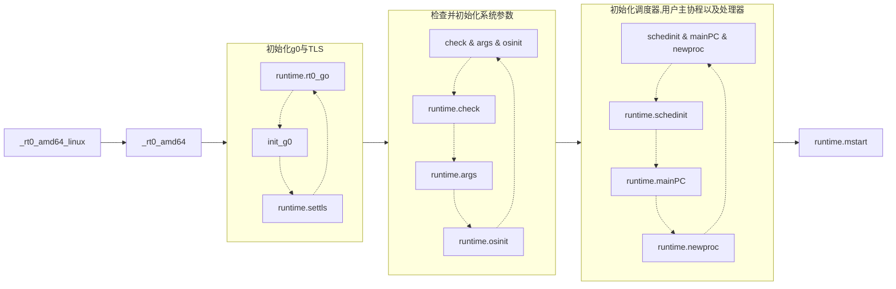
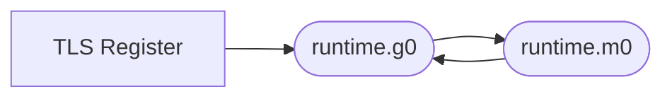

# Chapter 2: Go 协程

[TOC]

在这个章节将会介绍Go协程的实现机制，启动与执行方式。首先我们会通过讲解程序启动的过程来介绍特殊协程`g0`的启动过程从而理解最初的go协程是如何启动与初始化的，随后我们会深入到`runtime`中启动代码中用户定义的`go func() {}`函数代码来了解`g0`如何挂载在`m0`上调度并执行用户定义的协程。

## Go程序的启动
整个启动的关节节点如下,我们主要关注初始化`初始化g0与TLS`以及`初始化用户主协程`部分，因为这两部分对于理解Go程序的启动最为关键，其他部分将在第三章节`scheduler`中提到。
> 点击下图黄色区域跳转到github查看对应汇编代码


### Go程序的Entry Point

首先创建一个非常简单的main.go文件，内容如下:

```go
package main

func main() {}
```

使用如下命令找到其入口执行处:

```bash
$ go tool compile goroutine.go
$ go tool link goroutine.o
$ objdump -f a.out

a.out:     file format elf64-x86-64
architecture: i386:x86-64, flags 0x00000112:
EXEC_P, HAS_SYMS, D_PAGED
start address 0x0000000000453860	
```

可以看到**start address**是`0x0000000000453860`，使用如下命令反汇编执行文件查看这个位置对应的汇编代码:

```bash
$ objdump -d a.out > disassembly.s 
$ cat disassembly.s | grep 453860
0000000000453860 <_rt0_amd64_linux>:
453860:       e9 3b e3 ff ff          jmpq   451ba0 <_rt0_amd64>
```

可以看到整个程序的入口函数是 `_rt0_amd64_linux`，接下来便是要在go的src代码中找到这个函数的定义，实际上这个函数便位于 `src/runtime/rt0_linux_amd64.s` ，打开这个文件便能看到如下汇编代码。顺着JMP一直向下寻找调用的函数我们将会找到真正开始执行的函数叫做 `rt0_go`，整个跳转调用过程涉及两个文件三个汇编函数他们定义如下。

```asm
TEXT _rt0_amd64_linux(SB),NOSPLIT,$-8
  JMP	_rt0_amd64(SB)

TEXT _rt0_amd64(SB),NOSPLIT,$-8
  MOVQ	0(SP), DI	// argc
  LEAQ	8(SP), SI	// argv
  JMP	runtime·rt0_go(SB)
	
TEXT runtime·rt0_go(SB),NOSPLIT|TOPFRAME,$0
  # 可以看到此函数才是真正开始执行启动的汇编函数
```
### g0协程的初始化

接下来的分析中将会忽视掉 `runtime·rt0_go` 中对程序启动主体逻辑理解没有影响的代码，我们只关注g0是什么，g0的关键filed是如何被初始化的，g0在后续执行中扮演的角色，此外由于此过程冗长复杂，因此将函数分为多个部分来介绍。
		首先是基础的栈空间分配，仔细阅读了chapter-1的读者直接就能看出这部分只是简单分配了48字节的栈空间，顺便将argc与argv指针保存到了`SP+24`与`SP+32`的栈位置上。

```asm
MOVQ	DI, AX		// argc
MOVQ	SI, BX		// argv
SUBQ	$(5*8), SP		// 3args 2auto
ANDQ	$~15, SP
MOVQ	AX, 24(SP)
MOVQ	BX, 32(SP)
```

接下来便终于到了 *g0* 登场的时候了，这部分汇编首先将 *g0* 存储到了 `DI` Reg上, 这里我们看到汇编中 *g0* 的定义是 `runtime·g0(SB)`，在链接阶段这个符号会被链接到一个可执行文件的data section的静态变量上，而这个静态变量的定义就在 `src/runtime/proc.go` 中，其定义只有一行代码 `var g0 g` 其类型为 `g`。

随后`LEAQ	(-64*1024+104)(SP), BX`指令则是计算好g0的栈空间大小(**注意这里并没有修改SP寄存器的数据**)，随后将`BX`中的栈空间大小数据赋值给`g0.stackguard0`与`g0.stackguard1`两个filed，同时将`BX`中数据赋值给`g0.stack.lo`（内存分配是向低地址位置扩展），将当前`SP`中数据赋值给`g0.stack.hi` 。

走完这部分实际上`g0`所拥有的初始栈空间就已经被分配好了，其位于`SP`到`SP-64*1024+104`的地址空间中。
```asm
MOVQ	$runtime·g0(SB), DI
LEAQ	(-64*1024+104)(SP), BX
MOVQ	BX, g_stackguard0(DI)
MOVQ	BX, g_stackguard1(DI)
MOVQ	BX, (g_stack+stack_lo)(DI)
MOVQ	SP, (g_stack+stack_hi)(DI)
```

```go
type stack struct {
    lo uintptr
    hi uintptr
}

type g struct {
    stack       stack   // offset known to runtime/cgo
    stackguard0 uintptr // offset known to liblink
    stackguard1 uintptr // offset known to liblink
    // ......省略.......
}
```
### TLS的内部实现

在`amd64`平台上还有一个特殊的实现其涉及到了一个在`amd64`平台的特殊寄存器`TLS`（**Thread Local Storage**），在`amd64`平台上这个寄存器用来保存当前正在执行的goroutine的`g`结构体实例地址。
> 之所以叫TLS寄存器只是因为在go的伪汇编中将其视作为一个寄存器，实际上在Linux内核中以及实际物理CPU中是不存在这个寄存器的，其功能依赖于物理寄存器`FS`与`GS`来实现。具体细节可以查看
[3] [TLS code](https://elixir.bootlin.com/linux/v2.6.39/source/arch/x86/include/asm/segment.h#L170)。

> 对于go语言中的TLS使用&解释可以直接阅读[4] [TLS Comment](https://github.com/golang/go/blob/a6219737e3eb062282e6483a915c395affb30c69/src/cmd/internal/obj/x86/obj6.go#L72)，下面的汇编中需要运用到此comment中包含的知识，建议读者先阅读完再继续向下阅读。

> 需要注意的是在amd64平台R14寄存器也被用于存储当前正在执行的go协程地址，具体解释可以在[5] [abi-internal](https://github.com/golang/go/blob/master/src/cmd/compile/abi-internal.md)的amd64架构部分看到

```asm
needtls:
  LEAQ	runtime·m0+m_tls(SB), DI
  CALL	runtime·settls(SB)

  // store through it, to make sure it works
  get_tls(BX)
  MOVQ	$0x123, g(BX)
  MOVQ	runtime·m0+m_tls(SB), AX
  CMPQ	AX, $0x123
  JEQ 2(PC)
  CALL	runtime·abort(SB)
```
认真阅读了chapter-1的读者想必已经看出了上面汇编代码实际上最重要的就是初始的两行，第一行把全局变量`runtime.m0`(所在位置与g0相同)中的`tls`Filed地址保存到了`DI`寄存器，随后调用`runtime·settls`方法来初始化`tls`。

> 查看源码我们可以看到m0.tls的类型是`[tlsSlots]uintptr`其中`tlsSlots`的值等于6，在源码中对此有所解释	---- tlsSlots is the number of pointer-sized slots reserved for TLS on some platforms

我们看可以在`src/runtime/sys_linux_amd64.s`找到这个方法的具体实现如下所示。从注释中我们可以看到实际上这一块代码进行了一次`system call`调用了`arch_prctl`，并将`ARCH_SET_FS`[2] [arch_prctl](https://elixir.bootlin.com/linux/v2.6.39/source/arch/um/sys-x86_64/syscalls.c#L35)作为调用参数使用，在这个系统调用中将会初始化`FS`段寄存器的基值位置，对此感兴趣的读者可以自行阅读[1] [The segment](https://thestarman.pcministry.com/asm/debug/Segments.html)，到此为止`SYSCALL`执行前入参便准备好了，其中`SI` = 指向`runtime·m0+m_tls(SB) + 8` 位置，`DI` = `$0x1002`代表常量`ARCH_SET_FS`
用于控制`arch_prctl`执行逻辑，`AX` = `$SYS_arch_prctl`指向系统调用位置，执行完后`FS_base`寄存器就存储了`runtime·m0+m_tls(SB) + 8`的地址(实际上就是`[tlsSlots]uintptr`索引为1所在地址)。随后的三行便是简单的错误检查了。
```asm
TEXT runtime·settls(SB),NOSPLIT,$32
  ADDQ	$8, DI	// ELF wants to use -8(FS)
  MOVQ	DI, SI
  MOVQ	$0x1002, DI	// ARCH_SET_FS
  MOVQ	$SYS_arch_prctl, AX
  SYSCALL
  CMPQ	AX, $0xfffffffffffff001
  JLS	2(PC)
  MOVL	$0xf1, 0xf1  // crash
  RET
```
最后6行`get_tls(BX)`开始就是简单的加载下tls地址，尝试写入数据读取数据检查一下tls可不可以正常使用。
> get_tls只是个简单宏定义`#define	get_tls(r)	MOVL TLS, r`起作用仅仅是把TLS寄存器保存的g指针读取到指定的寄存器，g(BX)实际也是宏替换`#define	g(r)	0(r)(TLS*1)` -> `0(BX)(TLS*1)`其中`0(BX)`代表`BX`偏移为0的位置，后面的`(TLS*1)`只是一个标识符。具体细节请阅读[ELF Handling For Thread-Local Storage](https://akkadia.org/drepper/tls.pdf)中的4.4.6了解x86-64平台获取`TLS`的标准指令序列。

### 存储g0到TLS
正如前面所说`TLS`保存有当前正在执行的go协程实例指针，而当前有且只有准备好的`g0`协程需要执行，因此下一步便是将准备好的`g0`存储到`TLS`中。也就是下面指令中的 `LEAQ	runtime·g0(SB), CX`和`MOVQ	CX, g(BX)`，随后就是把m0.g0指向`runtime.g0`以及g0.m指向`runtime.m0`（这部分涉及第三章scheduler中GMP部分知识）。

```ams
ok:
  // set the per-goroutine and per-mach "registers"
  get_tls(BX)
  LEAQ	runtime·g0(SB), CX
  MOVQ	CX, g(BX)
  LEAQ	runtime·m0(SB), AX
  
  // save m->g0 = g0
  MOVQ	CX, m_g0(AX)
  // save m0 to g0->m
  MOVQ	AX, g_m(CX)

```
到这里TLS中已经指向了g0协程，且m0与g0也绑定了双向关系。到这里我们的程序基本上已经实现了如下状态。随后的初始化参数&调度器操作暂时跳过，这部分内容将会在章节三scheduler中介绍。


### 加载runtime.mian并创建新P

首先runtime·mainPC实际上指向了runtime.main函数

```asm
// mainPC is a function value for runtime.main, to be passed to newproc.
// The reference to runtime.main is made via ABIInternal, since the
// actual function (not the ABI0 wrapper) is needed by newproc.
DATA	runtime·mainPC+0(SB)/8,$runtime·main<ABIInternal>(SB)
GLOBL	runtime·mainPC(SB),RODATA,$8
```

```asm
// create a new goroutine to start program
MOVQ	$runtime·mainPC(SB), AX		// entry
PUSHQ	AX
CALL	runtime·newproc(SB)
POPQ	AX
```


### 

## 链接
[1] [The segment](https://thestarman.pcministry.com/asm/debug/Segments.html) 

[2] [arch_prctl](https://man7.org/linux/man-pages/man2/arch_prctl.2.html)

[3] [TLS code](https://elixir.bootlin.com/linux/v2.6.39/source/arch/um/sys-x86_64/syscalls.c#L35)

[4] [TLS Comment](https://github.com/golang/go/blob/a6219737e3eb062282e6483a915c395affb30c69/src/cmd/internal/obj/x86/obj6.go#L72)

[5] [ABI-Internal](https://github.com/golang/go/blob/master/src/cmd/compile/abi-internal.md)

[6] [ELF Handling For Thread-Local Storage](https://akkadia.org/drepper/tls.pdf)
