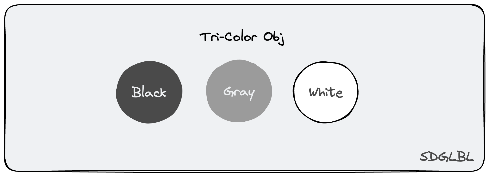
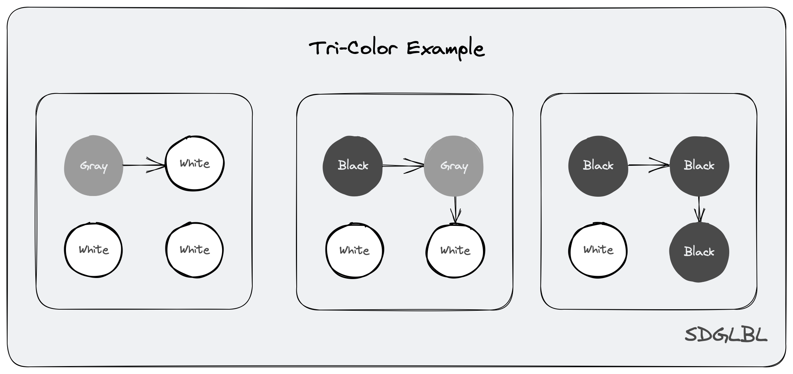

## 垃圾回收

垃圾回收过程是一个涉及多个阶段的过程，从编译期的垃圾回收信息标记，到运行期的信息分析，赋值器染色控制，回收器空间回收，如果回收还包括空间整理可能还会引入分代回收机制等过程（go 没有）。
如非专业弄懂所有细节几乎是不可能的事情（因为太复杂了），此篇只对最基本的流程进行说明和少许分析，更多的是关注源码实现的过程，建立一种大概印象而非追根刨底式的阐述所有算法细节（因为我也不甚了解 😂)）。

### Mutator 赋值器

### Collector 回收器

## 三色抽象

### 三色抽象

为了解决原始标记清除算法带来的长时间 STW，多数现代的追踪式垃圾收集器都会实现三色标记算法的变种以缩短 STW 的时间。三色标记算法将程序中的对象分成白色、黑色和灰色三类：

- 白色对象 潜在的垃圾，其内存可能会被垃圾收集器回收；
- 黑色对象 活跃的对象，包括不存在任何引用外部指针的对象以及从根对象可达的对象；
- 灰色对象 活跃的对象，因为存在指向白色对象的外部指针，垃圾收集器会扫描这些对象的子对象；



### Tri-color invariant / 三色抽象原则

- `强三色不变原则`：黑色对象不会指向白色对象，只会指向灰色对象或者黑色对象
- `弱三色不变原则`：黑色对象指向的白色对象必须存在于一条包含灰色对象的且可到此白色对象的可达路径中

- `根本原则`：无论是强还是弱三色不变原则其共同的最终目的都是为了保证内存中一定不存在白色对象无法被 GC 的路径遍历算法遍历到，需要保证这一点的前提只有一个 --- 那就是保证所有不需要被回收的白色对象的引用链路上游中至少存在一个灰色对象，所谓的强/弱原则只是满足这个前提的两种方式。

## 三色扫描

简单的说三色扫描方式就是不断重复如下三个步骤最终实现回收所有剩余白色对象

初始步骤：扫描所有栈，全局对象并将其中指向的堆对象都染灰并放入灰色队列中

1. 扫描灰色队列并将其中对象指向的其他对象置为灰色入队
2. 将扫描扫描的灰色对象置为黑色出队
3. 重复 1 步骤直到灰色队列为空

最后清除所有白色对象

我们需要做的事情就是找到一种办法在同时执行上述步骤的过程中保证赋值器不会导致对象被隐藏

> 被隐藏：指不应该被回收的对象被回收的情况发生，或者说存在不应该被回收的白色对象没有任何灰色对象可以到达它

一个简答的例子可以看如下图片所示



## Barrier / 屏障技术

关于屏障技术最佳的参考文档应该是官方的[Eliminate STW stack re-scanning](https://github.com/golang/proposal/blob/master/design/17503-eliminate-rescan.md)，如果想了解严格的说明和证明过程可以参考此文档。

一个需要注意的前提知识是我们无法（至少现在还无法）在栈，寄存器上进行（插入/删除) 写屏障，因为程序在栈上寄存器上的分配速度极快，需要在不影响性能的情况下执行 Hook 是一件极度复杂到几乎不可能的事情。

> Hook：对屏障的一种称呼，实际上屏障就是一种 Hook 方法，Hook 的对象便是不开启屏障时的写内存操作。

> 此外屏障只在垃圾回收过程中分配对象 `ptr` 才会被使用。

### Dijkstra Write Barrier / Dijkstra 插入写屏障 + 灰色赋值器

```go
func DijkstraWritePointer(slot *unsafe.Pointer, ptr unsafe.Pointer) {
    shade(ptr)
    *slot = ptr
}
```

`Dijkstra` 写屏障在指定位置 `slot` 写入指针 `ptr` 之前会通过 `shade(ptr)` 将 `ptr` 指向的白色对象强制转换为灰色对象以确保**强三色不变原则**不被破坏。如果我们不考虑染色性能在任何地方使用它就可以保证并发标记的无误性。(可惜没有如果)

其最大的缺陷便是在处理 `Stack` 上的指针写入时不得不考虑采取 1. 使用 `Dijkstra` 写屏障在将指针写入到栈上时进行染色（意味着巨大的性能消耗） 2. STW 并在此期间重新扫描所有栈上变量 两种方案中的一种。在 `1.9` 之前 go 选择的便是第二种方式解决这个问题。

> 因为 `Stack` 上的指针指向的对象是 `GC` 开始扫描的对象，如果我们在向一个已经被 `GC` 扫描过的 `Stack` 上保存指针同时不对其染色的时候，我们无法确定被保存的指针是否指向的是一个白色对象，也就无法保证三色原则中我们提到的根本原则，因此在 1.8 之前 go 会将垃圾回收过程中正在运行且在上进行了对象分配的的 stack 暂时保守性得染为灰色，其他栈则恒染为黑色，直到这个回收间隔最后 STW 的时候垃圾回收器最后重新扫描这些被保守置灰栈将它们从灰色置为黑色，保证在运行过程中新分配的栈上 `ptr` 指向的所有白色对象都被正常扫描到。

### Yuasa Write Barrier / Yuasa 删除写屏障 + 灰色赋值器

```go
func YuasaWritePointer(slot *unsafe.Pointer, ptr unsafe.Pointer) {
    rawPtr = *slot
    shade(rawPtr)
    *slot = ptr
}
```

`Yuasa` 写屏障不同于 `Dijkstra` 的地方就在于它染色的目标不是需要写入的值 `ptr` ，而是需要写入位置原来的指针 `rawPtr`，随后将 `ptr` 赋值到 `slot` 位置。也就是其确保了**弱三色不变原则**不被破坏，因为在写入 `ptr` 前原指针 `rawPtr` 会被 shade 染为灰色，此时 `rawPtr` 以及其指向对象所引用的其他对象都能保证被 `GC` 扫描到以此满足了 `根本原则`。因此通过这种方式可以完全实现不需要像`Dijkstra` 算法那样的标记后的 `STW Stack Scaning` 阶段，直接回收所有需要回收的白色对象。

其最大的缺陷如下两点

1. 其 `shade(*slot)` 的拦截写操作会导致扫描中对象可能出现从 黑色 -> 灰色得转化从而导致此对象被 `GC` 二次扫描而形成波面的后退，降低 `GC` 性能。

> `GC` 扫描标记可回收对象的过程就像一个海浪拂过对象之海一样，未标记与已标记对象的分界便是一个分界面，我们称其为**波面**。

2. 其扫描精度太低

### Dijkstra & Yuasa 两种屏障总结

在上述内容中我们可以认知到如下几点

- 两种屏障的缺陷实际上都是由栈，寄存器无法使用屏障 Hook 引起，两者都无法保证栈上新指向对象不为白色, 一个选择在扫描结束 `STW` 扫描栈重新标记，一个选择在扫描前 `STW` 提前扫描栈标记。

### Hybrid Write Barrier / 混合写屏障 + 黑色赋值器

```plain
writePointer(slot, ptr):
    shade(*slot)
    if current stack is grey:
        shade(ptr)
    *slot = ptr
```

在上述两种方式中都存
`Hybrid Write Barrier`意为混合写屏障，实际其包含了 `Yuasa` 和 `Dijkstra` 两种写屏障，混合写屏障结合了两种屏障的优点, 不需要在扫描开始和结束的时候 `STW` 扫描所有堆和栈, 扫描和清除并发执行。 (不过扫描单个的栈还是需要把对应的协程暂停这也是日后优化的方向)。

> 需要注意的是为了简化实现实际上 `runtime` 中的混合写屏障不会判断赋值器所在栈是否是灰色再给 `ptr` 染灰，而是直接染灰。也就是代码逻辑应该是

```plain
writePointer(slot, ptr):
    shade(*slot)
    shade(ptr)
    *slot = ptr
```

当然世上不存在完美的解决方案，混合写屏障虽然可以解决 `STW`，但支付的代价就是实现的复杂以及保守的对象图修改方式导致的回收精度下降问题，同时也会导致编译器无法使用一些优化手段比如 nil 指针写入优化。

### 混合写屏障有效性证明

参考文档 [Proof](./Proof.md)

## 混合写屏障源码分析

<dlv color="green">TODO:</dlv>

垃圾回收实现的原理决定了其涉及到如何标记对象，如何更新标记，如何回收标记了的对象多个过程，而这些过程又和语言本身的 ABI、内存结构，调用公约等设计息息相关，因此源码分析将会涉及到内存分配（分配时的初始标记），内存扫描（更新标记），内存回收（垃圾回收），逃逸分析（排除不需要 gc 的对象）....等。如果涉及内容在其他小节建议先阅读对应章节再继续。

## 链接

[1] [Eliminate STW stack re-scanning](https://github.com/golang/proposal/blob/master/design/17503-eliminate-rescan.md)

[2] [Runtime Symbol Infomation](https://docs.google.com/document/d/1lyPIbmsYbXnpNj57a261hgOYVpNRcgydurVQIyZOz_o/pub)

[3] [Yuasa 可终止证明](https://core.ac.uk/download/pdf/39218501.pdf)

[4] [Uniprocessor Garbage Collection Techniques](https://www.cs.cmu.edu/~fp/courses/15411-f14/misc/wilson94-gc.pdf)
