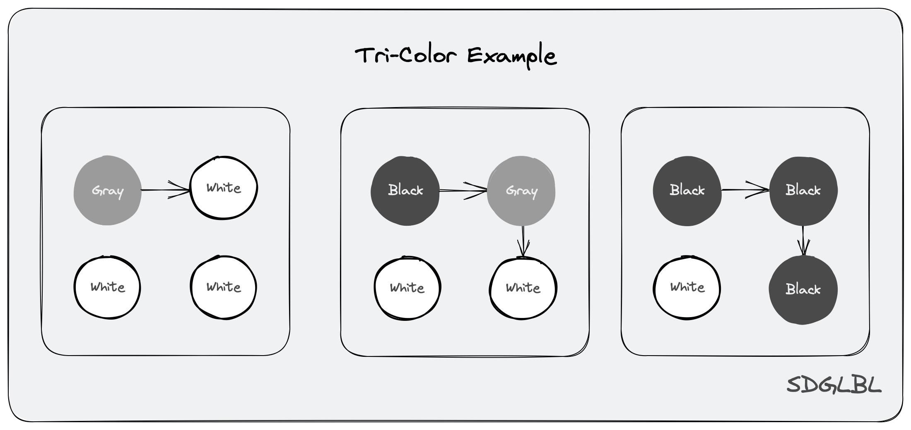

## 垃圾回收

垃圾回收过程是一个涉及多个阶段的过程，从编译期的垃圾回收信息标记，到运行期的信息分析，赋值器染色控制，回收器空间回收，如果回收还包括空间整理可能还会引入分代回收机制等过程（go 没有）。
如非专业弄懂所有细节几乎是不可能的事情（因为太复杂了），此篇只对最基本的流程进行说明和少许分析，更多的是关注源码实现的过程，建立一种大概印象而非追根刨底式的阐述所有算法细节（因为太复杂了容易班门弄斧）。
对于 go 垃圾回收的整体概述可以参考[官方说明](https://github.com/golang/go/tree/release-branch.go1.21/src/runtime/mgc.go#L7)

### Mutator 赋值器

赋值器顾名思义就是用于将特定 `ptr` 写入到特定 `slot` 的代码，对于理解垃圾回收我们将其看作是编译器或者runtime实现的一段hack了赋值语法的代码既可。在实现中实际上可以看作是这个函数 [`bulkBarrierPreWrite`](https://github.com/golang/go/tree/release-branch.go1.21/src/runtime/mbitmap.go#L514-L599)，在屏障开启过程中所有的 `move` 函数都会在真正运行前调用它。

```go
u := &User{"A",10}
b := &u.Name
// 直觉上我们认为 b := &u.Name 这段代码会直接由cpu将 &u.Name 写入到 b 位置处
// 但由于mutator存在，会将其hack为 mutator.set(&b,&u.Name) (mutator.set随便写的方便理解而已)
```

### Collector 回收器

回收器就是我们需要关心的垃圾回收主要执行者，但需要注意的是垃圾回收是一个跨多阶段的任务，回收器只是负责其中程序运行后的工作，但实际上脱离了编译期各种信息标记和赋值器染色控制等步骤回收器是无法运行起来的。简单地说回收器以特殊的触发算法控制其执行时机（比如到一定heap大小阈值启动，增加申请空间并回收），并一直以 并发标记 -> 并发清除 -> 结束 的循环进行垃圾回收工作，在众多资料中对于垃圾回收器的执行阶段有着详细的描述，这篇文章更关心的是运行在其背后的原理细节而非泛泛而谈的 “阶段” 解读，这些内容的简单程度读者可以直接阅读那些讲述这些内容的文章或者直接打开[mgc.go](https://github.com/golang/go/tree/release-branch.go1.21/src/runtime/mgc.go#L7)自己阅读即可。

## 三色抽象

### 三色抽象

为了解决原始标记清除算法带来的长时间 STW，多数现代的追踪式垃圾收集器都会实现三色标记算法的变种以缩短 STW 的时间。三色标记算法将程序中的对象分成白色、黑色和灰色三类：

- 白色对象 潜在的垃圾，其内存可能会被垃圾收集器回收；
- 黑色对象 活跃的对象，包括不存在任何引用外部指针的对象以及从根对象可达的对象；
- 灰色对象 活跃的对象，因为存在指向白色对象的外部指针，垃圾收集器会扫描这些对象的子对象；


### Tri-color invariant / 三色抽象原则

- `强三色不变原则`：黑色对象不会指向白色对象，只会指向灰色对象或者黑色对象
- `弱三色不变原则`：黑色对象指向的白色对象必须存在于一条包含灰色对象的且可到此白色对象的可达路径中

- `根本原则`：无论是强还是弱三色不变原则其共同的最终目的都是为了保证内存中一定不存在白色对象无法被 GC 的路径遍历算法遍历到，需要保证这一点的前提只有一个 --- 那就是保证所有不需要被回收的白色对象的引用链路上游中至少存在一个灰色对象，所谓的强/弱原则只是满足这个前提的两种方式。

## 三色扫描

简单的说三色扫描方式就是不断重复如下三个步骤最终实现回收所有剩余白色对象

初始步骤：扫描所有栈，全局对象并将其中指向的堆对象都染灰并放入灰色队列中

1. 扫描灰色队列并将其中对象指向的其他对象置为灰色入队
2. 将扫描扫描的灰色对象置为黑色出队
3. 重复 1 步骤直到灰色队列为空

最后清除所有白色对象

我们需要做的事情就是找到一种办法在同时执行上述步骤的过程中保证赋值器不会导致对象被隐藏

> 被隐藏：指不应该被回收的对象被回收的情况发生，或者说存在不应该被回收的白色对象没有任何灰色对象可以到达它

一个简答的例子可以看如下图片所示



## Barrier / 屏障技术

关于屏障技术最佳的参考文档应该是官方的**Eliminate STW stack re-scanning** [^1]，如果想了解严格的说明和证明过程可以参考此文档。

一个需要注意的前提知识是我们无法（至少现在还无法）在栈，寄存器上进行（插入/删除) 写屏障，因为程序在栈上寄存器上的分配速度极快，需要在不影响性能的情况下执行 Hook 是一件极度复杂到几乎不可能的事情。

> Hook：对屏障的一种称呼，实际上屏障就是一种 Hook 方法，Hook 的对象便是不开启屏障时的写内存操作。

> 此外屏障只在垃圾回收过程中分配对象 `ptr` 才会被使用。

### Dijkstra Write Barrier / Dijkstra 插入写屏障 + 灰色赋值器

```go
func DijkstraWritePointer(slot *unsafe.Pointer, ptr unsafe.Pointer) {
    shade(ptr)
    *slot = ptr
}
```

`Dijkstra` 写屏障在指定位置 `slot` 写入指针 `ptr` 之前会通过 `shade(ptr)` 将 `ptr` 指向的白色对象强制转换为灰色对象以确保**强三色不变原则**不被破坏。如果我们不考虑染色性能在任何地方使用它就可以保证并发标记的无误性。(可惜没有如果)

其最大的缺陷便是在处理 `Stack` 上的指针写入时不得不考虑采取 1. 使用 `Dijkstra` 写屏障在将指针写入到栈上时进行染色（意味着巨大的性能消耗） 2. STW 并在此期间重新扫描所有栈上变量 两种方案中的一种。在 `1.9` 之前 go 选择的便是第二种方式解决这个问题。

> 因为 `Stack` 上的指针指向的对象是 `GC` 开始扫描的对象，如果我们在向一个已经被 `GC` 扫描过的 `Stack` 上保存指针同时不对其染色的时候，我们无法确定被保存的指针是否指向的是一个白色对象，也就无法保证三色原则中我们提到的根本原则，因此在 1.8 之前 go 会将垃圾回收过程中正在运行且在上进行了对象分配的的 stack 暂时保守性得染为灰色，其他栈则恒染为黑色，直到这个回收间隔最后 STW 的时候垃圾回收器最后重新扫描这些被保守置灰栈将它们从灰色置为黑色，保证在运行过程中新分配的栈上 `ptr` 指向的所有白色对象都被正常扫描到。

### Yuasa Write Barrier / Yuasa 删除写屏障 + 灰色赋值器

```go
func YuasaWritePointer(slot *unsafe.Pointer, ptr unsafe.Pointer) {
    rawPtr = *slot
    shade(rawPtr)
    *slot = ptr
}
```

`Yuasa` 写屏障不同于 `Dijkstra` 的地方就在于它染色的目标不是需要写入的值 `ptr` ，而是需要写入位置原来的指针 `rawPtr`，随后将 `ptr` 赋值到 `slot` 位置。也就是其确保了**弱三色不变原则**不被破坏，因为在写入 `ptr` 前原指针 `rawPtr` 会被 shade 染为灰色，此时 `rawPtr` 以及其指向对象所引用的其他对象都能保证被 `GC` 扫描到以此满足了 `根本原则`。因此通过这种方式可以完全实现不需要像`Dijkstra` 算法那样的标记后的 `STW Stack Scaning` 阶段，直接回收所有需要回收的白色对象。

其最大的缺陷如下两点

1. 其 `shade(*slot)` 的拦截写操作会导致扫描中对象可能出现从 黑色 -> 灰色得转化从而导致此对象被 `GC` 二次扫描而形成波面的后退，降低 `GC` 性能。

> `GC` 扫描标记可回收对象的过程就像一个海浪拂过对象之海一样，未标记与已标记对象的分界便是一个分界面，我们称其为**波面**。

2. 其扫描精度太低

### Dijkstra & Yuasa 两种屏障总结

在上述内容中我们可以认知到如下几点

- 两种屏障的缺陷实际上都是由栈，寄存器无法使用屏障 Hook 引起，两者都无法保证栈上新指向对象不为白色, 一个选择在扫描结束 `STW` 扫描栈重新标记，一个选择在扫描前 `STW` 提前扫描栈标记。

### Hybrid Write Barrier / 混合写屏障 + 黑色赋值器

```plain
writePointer(slot, ptr):
    shade(*slot)
    if current stack is grey:
        shade(ptr)
    *slot = ptr
```

在上述两种方式中都存
`Hybrid Write Barrier`意为混合写屏障，实际其包含了 `Yuasa` 和 `Dijkstra` 两种写屏障，混合写屏障结合了两种屏障的优点, 不需要在扫描开始和结束的时候 `STW` 扫描所有堆和栈, 扫描和清除并发执行。 (不过扫描单个的栈还是需要把对应的协程暂停这也是日后优化的方向)。

> 需要注意的是为了简化实现实际上 `runtime` 中的混合写屏障不会判断赋值器所在栈是否是灰色再给 `ptr` 染灰，而是直接染灰。也就是代码逻辑应该是

```plain
writePointer(slot, ptr):
    shade(*slot)
    shade(ptr)
    *slot = ptr
```

当然世上不存在完美的解决方案，混合写屏障虽然可以部分(扫描单个栈还是得把对应协程停了才行)解决 `STW`，但支付的代价就是实现的复杂以及保守的对象图修改方式导致的回收精度下降问题，同时也会导致编译器无法使用一些优化手段比如 nil 指针写入优化。

### 混合写屏障有效性证明

详细的证明过程可以参考文档 [Proof](./Proof.md), 当然阅读**原文** [^1]是更好的选择。

这里给出一个在**原文** [^1]直觉解释的翻译（原文需要对赋值器&屏障交互动态过程有一定理解才能流畅读懂）。

需要注意的是**垃圾回收只关心heap不关心stack**，所以下述直觉说明中的 `slot` 都在 heap 上，`ptr` 指向对象也都在 heap 上。

> In the hybrid barrier, the two shades and the condition work together to prevent a mutator from hiding an object:
>
> shade(\*slot) prevents a mutator from hiding an object by moving the sole pointer to it from the heap to its stack. If it attempts to unlink an object from the heap, this will shade it.

`shade(*slot)` 可以防止赋值器在将一个指向对象的 `ptr` 指针写入到 `slot` 的时候将 `old *slot` 原本指向的对象从垃圾回收器的眼中隐藏掉，因为不证自明的我们在将 `ptr` 写入 `slot` 时 `old *slot` 原本指向的对象可能是白色的，此时为了防止出现 `black heap obejct` -> `old *slot` 情况时出现黑色指向白色的情况，我们需要保护性的将 `old *slot` 变为灰色，以保证强三色不变原则。

> shade(ptr) prevents a mutator from hiding an object by moving the sole pointer to it from its stack into a black object in the heap. If it attempts to install the pointer into a black object, this will shade it.

`shade(ptr)` 可以防止赋值器在将一个指向堆对象的 `ptr` 写入到 `slot` 时将其从垃圾回收器眼中隐藏掉，理解这段话的关键在于读懂 `from its stack`，不证自明的我们在获取 `ptr` 这个值只可能是当前 `goroutine stack` 复制来的，这就说明在将 `ptr` 写入到 `slot` 前必定有一个 `goroutine stack` 持有 `ptr`，假设原本持有 `ptr` 的 `goroutine stack` 是灰色的我们就无法确保 `ptr` 已经被染为灰色了，此时将其写入到 `slot` 时必须将其染色为灰色，从而确保堆中对象不会出现黑色对象指向白色对象的情况。

如果不关心具体详细数学证明的话，对其理解达到看懂上述两段话的水平也就足够了。

## 混合写屏障源码分析

在 go 中实现屏障的代码在**mbarrier.go** [^6]，[其中](https://github.com/golang/go/tree/release-branch.go1.21/src/runtime/mbarrier.go#L23-L60)概述了混合写屏障的内容。

垃圾回收实现的原理决定了其涉及到如何标记对象，如何更新标记，如何回收标记了的对象多个过程，而这些过程又和语言本身的 ABI、内存结构，调用公约等设计息息相关，因此源码分析将会涉及到内存分配（分配时的初始标记），内存扫描（更新标记），内存回收（垃圾回收），逃逸分析（排除不需要 gc 的对象）....等。如果涉及内容在其他小节建议先阅读对应章节再继续。

### 编译期

#### 汇编插入 GCDATA

#### 逃逸分析减少堆上对象分配

### 运行期

#### Mutator 赋值器

##### 对象分配时

通过查看 [`mallocgc`](https://github.com/golang/go/blob/9f834a559c9ed6cdf883e29b36e21e5f956df74f/src/runtime/malloc.go#L875-L1193) 可以看到在堆上分配对象时有如下代码控制，保证在 GC 过程中分配的对象都为黑色。

```go
func mallocgc(size uintptr, typ *_type, needzero bool) unsafe.Pointer {
    // ......... 省略 ..........
    // Allocate black during GC.
    if gcphase != _GCoff {
        gcmarknewobject(span, uintptr(x), size)
    }
    // ......... 省略 ..........
}
```

##### 修改栈上对象时

##### 修改对堆上对象时

#### Collector 回收器

##### 回收触发

触发垃圾回收操作由 [`gctrigger.test`](https://github.com/golang/go/blob/9f834a559c9ed6cdf883e29b36e21e5f956df74f/src/runtime/mgc.go#L543-L569) 来负责

```go
func (t gcTrigger) test() bool {
    if !memstats.enablegc || panicking.Load() != 0 || gcphase != _GCoff {
        return false
    }
    switch t.kind {
    case gcTriggerHeap:
        // Non-atomic access to gcController.heapLive for performance. If
        // we are going to trigger on this, this thread just
        // atomically wrote gcController.heapLive anyway and we'll see our
        // own write.
        trigger, _ := gcController.trigger()
        return gcController.heapLive.Load() >= trigger
    case gcTriggerTime:
        if gcController.gcPercent.Load() < 0 {
            return false
        }
        lastgc := int64(atomic.Load64(&memstats.last_gc_nanotime))
        return lastgc != 0 && t.now-lastgc > forcegcperiod
    case gcTriggerCycle:
        // t.n > work.cycles, but accounting for wraparound.
        return int32(t.n-work.cycles.Load()) > 0
    }
    return true
}

```

从代码可以看到出发实际上分为了多种类型，有通过堆大小进行判断的 `gcTriggerHeap`，有通过出发间隔进行判断的 `gcTriggerTime`，还有通过回收次数小于特定值进行判断的 `gcTriggerCycle`。

后两种比较简单阅读源码即可，我们此处只关心第一种堆大小判断方式的实现，可以看到代码实际上关键在于使用 `gcController` 计算了触发的阈值 [`trigger`](https://github.com/golang/go/blob/9f834a559c9ed6cdf883e29b36e21e5f956df74f/src/runtime/mgcpacer.go#L1060-L1140) 和当前已经使用了的堆负载 [`heapLive.Load()`](https://github.com/golang/go/blob/9f834a559c9ed6cdf883e29b36e21e5f956df74f/src/runtime/mgcpacer.go#L170-L189) 进行比对，当堆负载大于阈值的时候出发垃圾回收。

##### 并发标记

此外如果想顺便了解并发标记设计可以参考[**Concurrent stack re-scanning**] [^5]。

##### STW 扫描

[`stopTheWorldWithSema`](https://github.com/golang/go/blob/9f834a559c9ed6cdf883e29b36e21e5f956df74f/src/runtime/proc.go#L1219-L1318)

##### 并发清理

## 链接

[^1]: [Eliminate STW stack re-scanning](https://github.com/golang/proposal/blob/master/design/17503-eliminate-rescan.md)
[^2]: [Runtime Symbol Infomation](https://docs.google.com/document/d/1lyPIbmsYbXnpNj57a261hgOYVpNRcgydurVQIyZOz_o/pub)
[^3]: [Yuasa 可终止性证明](https://core.ac.uk/download/pdf/39218501.pdf)
[^4]: [Uniprocessor Garbage Collection Techniques](https://www.cs.cmu.edu/~fp/courses/15411-f14/misc/wilson94-gc.pdf)
[^5]: [Concurrent stack re-scanning](https://github.com/golang/proposal/blob/master/design/17505-concurrent-rescan.md)
[^6]: [mbarrier.go](https://github.com/golang/go/tree/release-branch.go1.21/src/runtime/mbarrier.go#L1)
